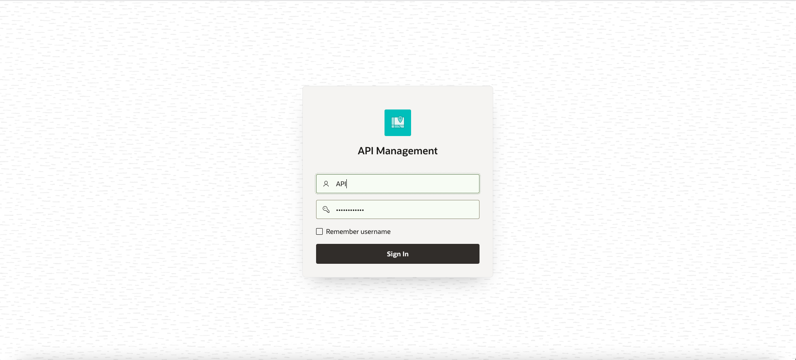

# Integrate to the Components together

## Introduction

Estimated time: 20 min

### Objectives

- Install the API Portal

### Prerequisites

Open the Oracle Cloud Shell and clone this repository on your laptop first.

```
<copy>git clone https://github.com/mgueury/oci-api-portal.git</copy>
```

Create a file to take your notes

````
##1##: DB Password    : (ex LiveLab__123)
##2##: APEX Host Name : (ex: abcdefghijk-db123.adb.eu-frankfurt-1.oraclecloudapps.com)
````

## Task 1: Create an Autonomous database

First, let's create an Autonomous database.

Go the menu
- Oracle Database
- Autonomous Database


Click *Create Autonomous Database*
- Compartment : *Your Favorite Compartment*
- Display Name: *APIDB*
- Database Name: *APIDB* 
- Workload: *Transaction Processing*
- Deployment: *Shared Infrastructure*
- Password: ex: *LiveLab__123* (##1##)
- Network: Keep *Secure Access from Everywhere*
- Licence: *BYOL or Licence Included*
- Then *Create Autonomous Database*


## Task 2: Create the API Schema

In the page of the Autonomous Database,
- Click on *Database Actions*
- If you get a prompt asking for an user/password, enter ADMIN/database password see ##1##
- Then *SQL*

- Run the following SQL to give right to the user API:
- Replace the password in the schema creation to your own and take note of it ##1b##

```
grant connect, resource, unlimited tablespace, create view to API identified by LiveLab__123
/
GRANT execute ON dbms_cloud_oci_ag_deployment_list_deployments_response_t TO API;
GRANT execute ON dbms_cloud_oci_apigateway_deployment_collection_t TO API;
GRANT execute ON dbms_cloud_oci_apigateway_deployment_summary_tbl TO API;
GRANT execute ON dbms_cloud_oci_apigateway_deployment_summary_t TO API;
GRANT execute ON DBMS_CLOUD_OCI_AG_DEPLOYMENT TO API;
GRANT execute ON DBMS_CLOUD TO API;
/
-- 
BEGIN
  ORDS.enable_schema(
    p_enabled             => TRUE,
    p_schema              => 'API',
    p_url_mapping_type    => 'BASE_PATH',
    p_url_mapping_pattern => 'apim',
    p_auto_rest_auth      => FALSE
  );
  COMMIT;
end;
/

BEGIN
  ORDS.enable_schema(
    p_enabled             => FALSE,
    p_schema              => 'WKSP_API',
    p_url_mapping_type    => 'BASE_PATH',
    p_url_mapping_pattern => 'del',
    p_auto_rest_auth      => FALSE
  );
  COMMIT;
end;
/
```


## Task 3: Install the APEX program

Back to page of the Autonomous Database,
- Click again on *Database Actions*


- Click *APEX*
- First note the URL of APEX, we need the Apex Host Name (##2##) later in the lab (Ex: abcdefghijk-db123.adb.eu-frankfurt-1.oraclecloudapps.com) 
- In Administration Service, enter the DB password (##1##)
- Click *Sign In to Administration*


- Click *Create Workspace*


- Click *Existing Schema*


- Database User *API*
- Workspace Name *API*
- Workspace Username *API*
- Workspace Password ex: *LiveLab__123* (##2##)
- Click *Create Workspace*


This will create also a DB user WKSP_API

- Click on your user name (top right). Then *Sign-out*
- In the APEX login page
    - Workspace: *API*
    - Database User: *API*
    - Password: See ##2##
    - Click *Sign In*
- In Apex, 
    - Click Menu *App Builder*
    - *Import*


  

- Go in the files that you have downloaded from GIT 
- Choose *apex/apex_apim.sql*
- Click *Next*
- Click *Next*
- Click *Install Application*
- In Install Application, Click *Next*
- Click *Install*

We have now a running API Management Portal but it is empty.
- Click *Run Application*

## Task 3: Test the empty installation

We have now a running API Management Portal but it is empty.
- Login *API* / Password - See ##2##



In the next Lab, we will populate the Portal with APIs.


## Acknowledgements

- **Author**
    - Marc Gueury / Tom Bailiu / Valeria Chiran