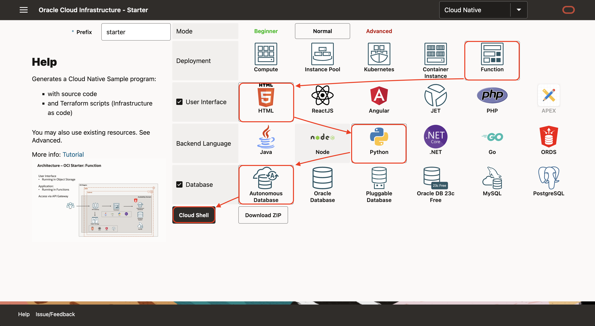
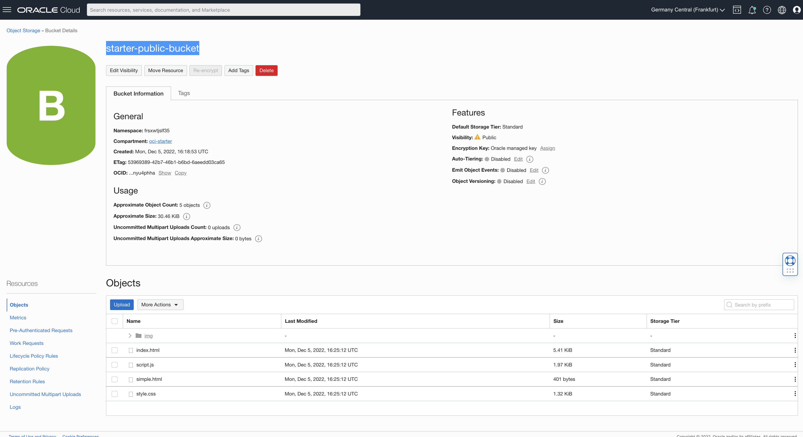

# Create Cloud Native Serverless Functions

## Introduction

Estimated time: 10 min

### Objectives


In this sample, using terraform, we will create a Function with Python, an Object Storage for the HTML and an Autonomous Database. 

The steps are identical for all other user interfaces, backends or database.

### Prerequisites

Please read the chapter: Introduction and Get Started.

## Task 1: Create the Application

In the OCI Starter website: 
- Go to https://www.ocistarter.com/
- Choose 
  - Function
  - HTML
  - Python
  - Autonomous Database
- Click *Cloud Shell*
  - You will see the commands to use.


In OCI,
- Login to your OCI account
  - Click *Code Editor*
  - Click *New Terminal*
  - Copy paste the command below. And check the README.md

```
<copy>
curl "https://www.ocistarter.com/app/zip?prefix=starter&deploy=function&ui=html&language=python&database=atp" --output starter.zip
unzip starter.zip
cd starter
cat README.md
</copy>
```


## Task 2: Main files

In the code editor:
- Click *File* /  *Open*
- Choose the directory *starter*
- Click *Open*


The main files are:

#### Commands
- build.sh      : Build the whole program: Run Terraform, Configure the DB, Build the App, Build the UI
- destroy.sh    : Destroy the objects created by Terraform
- env.sh        : Contains the settings of your project

#### Directories
- src           : Sources files
    - app         : Source of the Backend Application (Command: build_app.sh)
    - ui          : Source of the User Interface (Command: build_ui.sh)
    - db          : SQL files of the database
    - terraform   : Terraform scripts (Command: plan.sh / apply.sh)
- bin            : with some helper commands
    - bin/ssh\_bastion.sh (to ssh to the Bastion)


We will need an AUTH Token to login to the Docker Container Registry.
Let's create one:
- Click on the top left icon
- Click your username
- In the menu on the right, choose Auth Tokens
- Click *Generate Token*
- Give a name 
- Click *Generate Token*
- Then copy the value ##AUTH-TOKEN##


Edit the env.sh file:
- Choose the env.sh file.
- Look for \_\_TO_FILL\_\_ in the file
- For TF\_VAR\_auth\_token, use the ##AUTH-TOKEN## value that you just above. 
- For TF\_VAR\_database\_password, You may leave it like this.
    - If not filled, the "db password" will be randomly generated
- Ideally, you can also use an existing compartment if you have one. 
    - If not, the script will create a "oci-starter" compartment

## Task 3: Build.sh

Before to run the build. Notice that the build will create:
- Network resources: VCN, Subnet
- An Autonomous Database database
- An API Gateway to route the HTTP Requests to the Function or Object Storage
- An Function Application with one function
- An Object Storage with the HTML files
- A bastion used mostly to populate the database with the table

In the code editor, 
- in the menu *Terminal / New Terminal*. 
- then run:
```
<copy>
./build.sh
</copy>
```

It will build all and at the end you will see:
```
<copy>
- User Interface : https://xxxxxx.apigateway.eu-xxxx.oci.customer-oci.com/starter/
- Rest DB API : https://xxxxxx.apigateway.eu-xxxx.oci.customer-oci.com/starter/dept
- Rest Info API : https://xxxxxx.apigateway.eu-xxxx.oci.customer-oci.com/starter/info
</copy>
```

In cold start, the first function call with take about 40 secs to run. If you want instant response, you need to configure the [Provisioned Concurrency](https://docs.oracle.com/en-us/iaas/Content/Functions/Tasks/functionsusingprovisionedconcurrency.htm].

Click on the URL or go to the link to check that it works.
- All running in Serverless Mode 
- You have HTML pages stored in Object Storage doing REST calls 
- To a Python backend
- That backend gets data from an Autonomous Database

## Task 4: More info

### Customize
Please also check the  "Lab 5 - How to Customize" to see how to customize this sample to your needs

### Object Storage
During the build, it will generate an Object Storage to store the HTML file.
In the OCI menu, go to Storage / Buckets
You will find a bucket : starter-public-bucket with the HTML files.




### Function
It will also create a Function Application.
In the OCI menu, go to Developer Services / Function Application
You will find a Application starter-fn-application

### Cleanup

To clean up, run 
```
<copy>
./destroy.sh
</copy>
```

```
<copy>
cd ..
rm -R starter
</copy>
```

## Acknowledgements

- **Author**
    - Marc Gueury
    - Ewan Slater

- **History** - Creation - 30 Nov 2022

