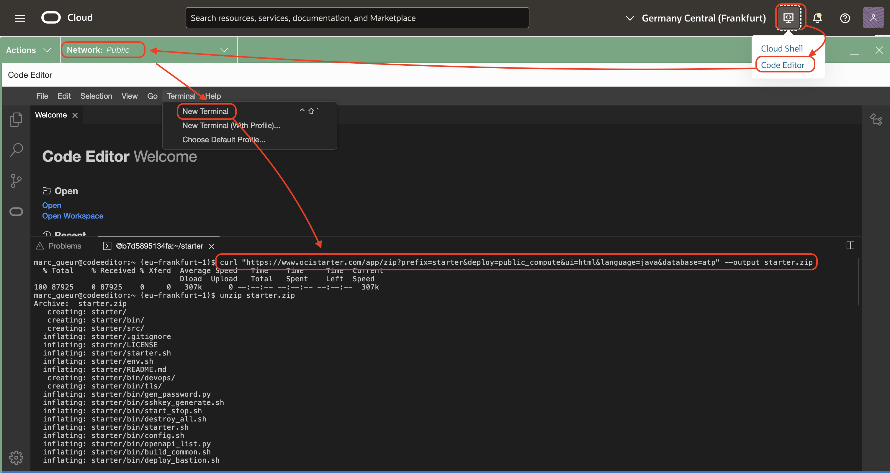
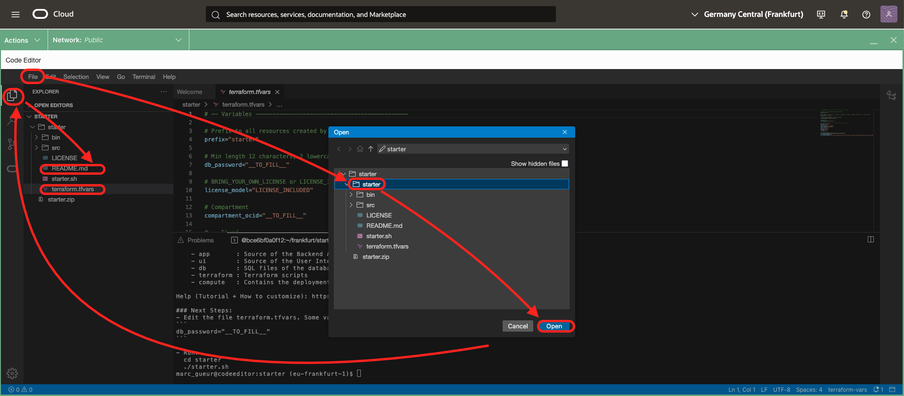

# Create Cloud Native Serverless Functions

## Introduction

Estimated time: 10 min

### Objectives


In this sample, using terraform, we will create: 
- a Serverless Function with Python
- an Object Storage for the HTML
- and an Autonomous Database. 

The steps are identical for all other user interfaces, backends or database.

### Prerequisites

Please read the chapter: Introduction and Get Started.

## Task 1: Create the Application

1. Using your browser, go to https://www.ocistarter.com/
2. Choose 
    - AMD (x86)
    - Function
    - HTML
    - Python
    - Autonomous Database
3. Click *Cloud Shell*
    - You will see the commands to use.
    
4. Login to your OCI account
    - Click *Code Editor*
    - Click *New Terminal*
    - Copy paste the command below. And check the README.md
    ```
    <copy>
    curl "https://www.ocistarter.com/app/zip?prefix=starter&deploy=function&ui=html&language=python&database=atp" --output starter.zip
    unzip starter.zip
    cd starter
    cat README.md
    </copy>
    ```
    

## Task 2: Main files

1. In the code editor:
    - Click *File* /  *Open*
    - Choose the directory *starter*
    - Click *Open*
    
2. The main files are:

   |             |                  |           | Description |
   | ----------- | ---------------- | --------- | ---|
   | Commands    |                  |           |  |
   |             | starter.sh       |           | Build or destroy a project. Show a menu with commands if not argument is given | 
   |             | terraform.tfvars |           | Settings of your project | 
   | Directories |                  |           | Commands used by starter.sh | 
   |             | bin/             |           | Commands used by starter.sh | 
   |             | src/             |           | Sources files | 
   |             |                  | app       | Backend Application (Command: build_app.sh) | 
   |             |                  | ui        | User Interface (Command: build_ui.sh) | 
   |             |                  | db        | Database initialisation files (SQL, ...) | 
   |             |                  | terraform | Terraform scripts  | 
   |             | target/          |           | Output directory  | 
  
3. Edit the terraform.tfvars file:
    - Look for \_\_TO_FILL\_\_ in the file
    - You may leave it like this.
        - If not filled, the "db password" will be randomly generated
    - Ideally, you can also use an existing compartment if you have one. 
        - If not, the script will ask to reuse one or to create an "oci-starter" compartment
    


## Task 3: Starter.sh

Before to run the build. Notice that the build will create:
- Network resources: VCN, Subnet
- An Autonomous Database database
- An API Gateway to route the HTTP Requests to the Function or Object Storage
- An Function Application with one function
- An Object Storage with the HTML files
- A bastion used mostly to populate the database with the table

1. In the code editor, 
    - in the menu *Terminal / New Terminal*. 
    - then run:
    ```
    <copy>
    ./starter.sh
    </copy>
    ```
    - Choose **Build**
             
    - It will build all and at the end you will see:
    ```
    <copy>
    - User Interface : https://xxxxxx.apigateway.eu-xxxx.oci.customer-oci.com/starter/
    - Rest DB API : https://xxxxxx.apigateway.eu-xxxx.oci.customer-oci.com/starter/dept
    - Rest Info API : https://xxxxxx.apigateway.eu-xxxx.oci.customer-oci.com/starter/info
    </copy>
    ```
2. Notice, during a cold start, the first function call with take about 40 secs to run. If you want instant response, you need to configure the [Provisioned Concurrency](https://docs.oracle.com/en-us/iaas/Content/Functions/Tasks/functionsusingprovisionedconcurrency.htm].
3. Click on the URL or go to the link to check that it works:
    - All running in Serverless Mode 
    - You have HTML pages stored in Object Storage doing REST calls 
    - To a Python backend
    - That backend gets data from an Autonomous Database

## Task 4: More info

### Customize
Please also check the  "Lab 7 - How to Customize" to see how to customize this sample to your needs

### Object Storage
During the build, it will generate an Object Storage to store the HTML file.
In the OCI menu, go to Storage / Buckets
You will find a bucket : starter-public-bucket with the HTML files.


### Function
It will also create a Function Application.
In the OCI menu, go to Developer Services / Function Application
You will find a Application starter-fn-application

### Cleanup

1. To clean up, run 
    ```
    <copy>
    ./starter.sh destroy
    </copy>
    ```

    ```
    <copy>
    cd ..
    rm -R starter
    </copy>
    ```

## Acknowledgements

* Author - Marc Gueury
* Contributors - Ewan Slater 
* Last Updated - Jan, 20th 2025

