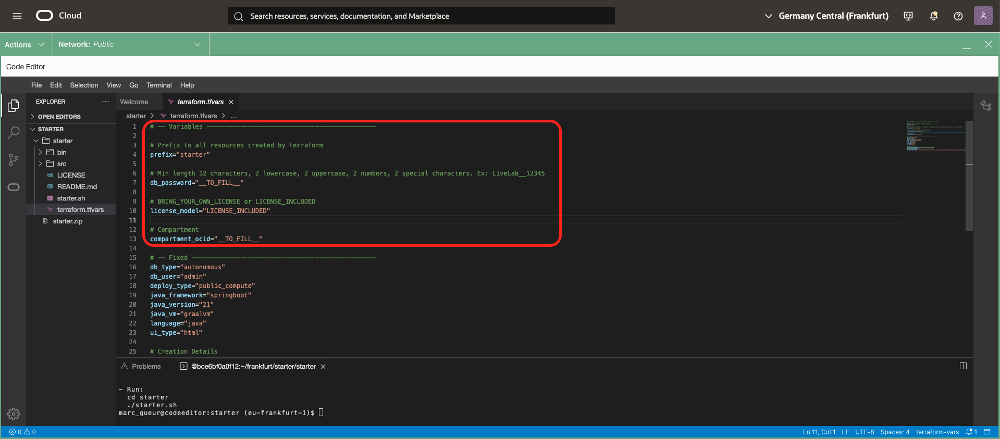
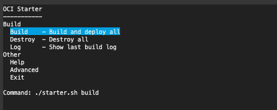

# Create Cloud Native Containers using Kubernetes (OKE) 

## Introduction

Estimated time: 10 min

### Objectives


In this sample, using terraform, we will create:
- a Kubernetes cluster with 2 pods
- one pod for NGINX and ReactJS
- one with NodeJS
- and a MySQL Database. 

The steps are identical for all other user interfaces, backends or database.

### Prerequisites

Please read the chapter: Introduction and Get Started.

## Task 1: Create the Application

1. Using your browser, go to https://www.ocistarter.com/
2. Choose 
    - AMD (x86)
    - Kubernetes
    - ReactJS
    - Node
    - MySQL
3. Click *Cloud Shell*
    - You will see the commands to use.
    
4. Login to your OCI account
    - Click *Code Editor*
    - Click *New Terminal*
    - Copy paste the command below. And check the README.md
    ```
    <copy>
    curl "https://www.ocistarter.com/app/zip?prefix=starter&deploy=kubernetes&ui=reactjs&language=node&database=mysql" --output starter.zip
    unzip starter.zip
    cd starter
    cat README.md
    </copy>
    ```
    

## Task 2: Main files

1. In the code editor:
    - Click *File* /  *Open*
    - Choose the directory *starter*
    - Click *Open*
    
2. The main files are:

   |             |                  |           | Description |
   | ----------- | ---------------- | --------- | ---|
   | Commands    |                  |           |  |
   |             | starter.sh       |           | Build or destroy a project. Show a menu with commands if not argument is given | 
   |             | terraform.tfvars |           | Settings of your project | 
   | Directories |                  |           | Commands used by starter.sh | 
   |             | bin/             |           | Commands used by starter.sh | 
   |             | src/             |           | Sources files | 
   |             |                  | app       | Backend Application (Command: build_app.sh) | 
   |             |                  | ui        | User Interface (Command: build_ui.sh) | 
   |             |                  | db        | Database initialisation files (SQL, ...) | 
   |             |                  | terraform | Terraform scripts  | 
   |             |                  | oke       | Deployment to Kubernetes | 
   |             | target/          |           | Output directory  | 
  
3. Edit the terraform.tfvars file:
    - Look for \_\_TO_FILL\_\_ in the file
    - You may leave it like this.
        - If not filled, the "db password" will be randomly generated
    - Ideally, you can also use an existing compartment if you have one. 
        - If not, the script will ask to reuse one or to create an "oci-starter" compartment
    

## Task 3: Starter.sh

Before to run the build. Notice that the build will create:
- Network resources: VCN, Subnet
- A MySQL database
- An Oracle Container Engine for Kubernetes (OKE) with 2 nodes.
- A bastion used mostly to populate the database with the table

1. In the code editor, 
    - in the menu *Terminal / New Terminal*. 
    - then run:
    ```
    <copy>
    ./starter.sh
    </copy>
    ```
    - Choose **Build**
             
    - It will build all and at the end you will see:
    ```
    <copy>
    - User Interface : http://123.123.123.123/
    - Rest DB API : http://123.123.123.123/app/dept
    - Rest Info API : http://123.123.123.123/app/info
    </copy>
    ```
2. Click on the URL or go to the link to check that it works:
    - All running in a Kubernetes 
    - You have ReactJS pages doing REST calls 
    - To a NodeJS - Express backend
    - That backend gets data from MySQL database
    

## Task 4: More info

### Customize

Please also check the  "Lab 7 - How to Customize" to see how to customize this sample to your needs

### Kubernetes

During the build, it will generate an Kubernetes cluster, do this to access it:

```
<copy>
./starter.sh env
kubectl get pods
</copy>
```

```
<copy>
NAME                                     READY   STATUS    RESTARTS   AGE
starter-app                              1/1     Running   0          86s
starter-ui                               1/1     Running   0          83s
</copy>
```
```
<copy>
kubectl get service
kubectl get ingress
</copy>
```

By default, the pods for the User Interface and Application are generated in the default namespace.

### Cleanup

1. To clean up, run 
    ```
    <copy>
    ./starter.sh destroy
    </copy>
    ```

    ```
    <copy>
    cd ..
    rm -R starter
    </copy>
    ```

## Acknowledgements

* Author - Marc Gueury
* Contributors - Ewan Slater 
* Last Updated - June, 2nd 2025
