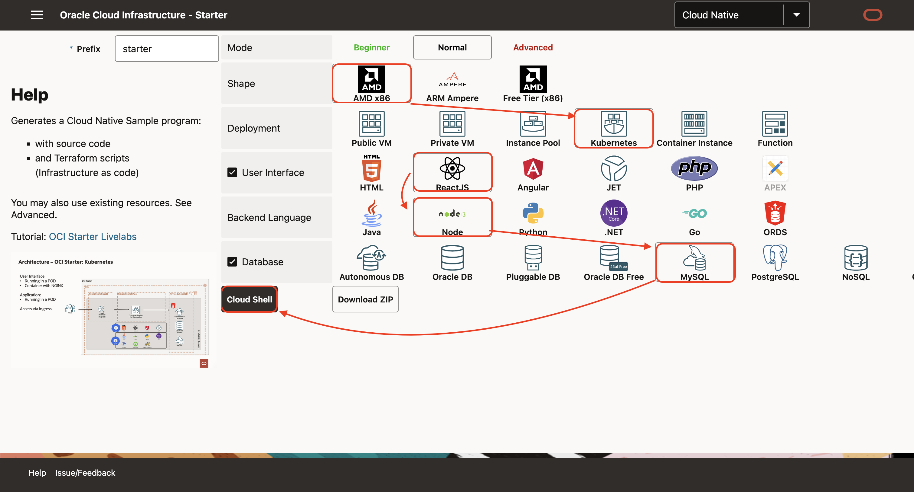
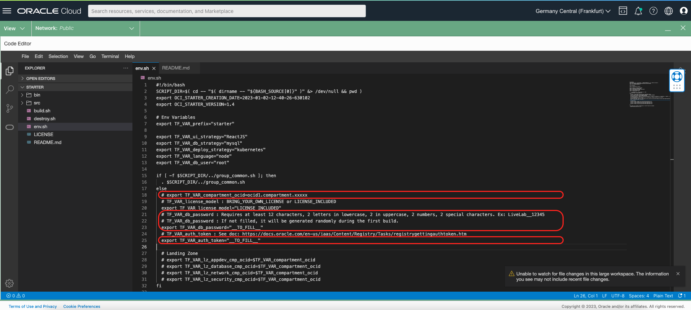

# Create Cloud Native Containers using Kubernetes (OKE) 

## Introduction

Estimated time: 10 min

### Objectives


In this sample, using terraform, we will create a Kubernetes cluster (with 2 pods, one for NGINX and ReactJS, one with NodeJS) and a MySQL Database. 

The steps are identical for all other user interfaces, backends or database.

### Prerequisites

Please read the chapter: Introduction and Get Started.

## Task 1: Create the Application

In the OCI Starter website: 
- Go to https://www.ocistarter.com/
- Choose 
  - Kubernetes
  - ReactJS
  - Node
  - MySQL
- Click *Cloud Shell*
  - You will see the commands to use.


In OCI,
- Login to your OCI account
  - Click *Code Editor*
  - Click *New Terminal*
  - Copy paste the command below. And check the README.md

```
<copy>
curl "https://www.ocistarter.com/app/zip?prefix=starter&deploy=kubernetes&ui=reactjs&language=node&database=mysql" --output starter.zip
unzip starter.zip
cd starter
cat README.md
</copy>
```


## Task 2: Main files

In the code editor:
- Click *File* /  *Open*
- Choose the directory *starter*
- Click *Open*


The main files are:

#### Commands
- build.sh      : Build the whole program: Run Terraform, Configure the DB, Build the App, Build the UI
- destroy.sh    : Destroy the objects created by Terraform
- env.sh        : Contains the settings of your project

#### Directories
- src           : Sources files
    - app         : Source of the Backend Application (Command: build_app.sh)
    - ui          : Source of the User Interface (Command: build_ui.sh)
    - db          : SQL files of the database
    - terraform   : Terraform scripts (Command: plan.sh / apply.sh)
    - oke         : Contains the deployment files to Kubernetes
- bin            : with some helper commands
    - bin/ssh\_bastion.sh (to ssh to the Bastion)

We will need an AUTH Token to login to the Docker Container Registry.
Let's create one:
- Click on the top left icon
- Click your username
- In the menu on the right, choose Auth Tokens
- Click *Generate Token*
- Give a name 
- Click *Generate Token*
- Then copy the value ##AUTH-TOKEN##


Edit the env.sh file:
- Choose the env.sh file.
- Look for \_\_TO_FILL\_\_ in the file
- For TF\_VAR\_auth\_token, use the ##AUTH-TOKEN## value that you just above. 
- For TF\_VAR\_database\_password, You may leave it like this.
    - If not filled, the "db password" will be randomly generated
- Ideally, you can also use an existing compartment if you have one. 
    - If not, the script will create a "oci-starter" compartment



## Task 3: Build.sh

Before to run the build. Notice that the build will create:
- Network resources: VCN, Subnet
- A MySQL database
- An Oracle Container Engine for Kubernetes (OKE) with 2 nodes.
- A bastion used mostly to populate the database with the table

In the code editor, 
- in the menu *Terminal / New Terminal*. 
- then run:
```
<copy>
./build.sh
</copy>
```

It will build all and at the end you will see:
```
<copy>
- User Interface : http://123.123.123.123/
- Rest DB API : http://123.123.123.123/app/dept
- Rest Info API : http://123.123.123.123/app/info
</copy>
```

Click on the URL or go to the link to check that it works.
- All running in a Kubernetes 
- You have ReactJS pages doing REST calls 
- To a NodeJS - Express backend
- That backend gets data from MySQL database


## Task 4: More info

### Customize

Please also check the  "Lab 5 - How to Customize" to see how to customize this sample to your needs

### Kubernetes

During the build, it will generate an Kubernetes cluster, do this to access it:

```
<copy>
. ./env.sh
kubectl get pods
</copy>
```

```
<copy>
NAME                                     READY   STATUS    RESTARTS   AGE
starter-app                              1/1     Running   0          86s
starter-ui                               1/1     Running   0          83s
</copy>
```
```
<copy>
kubectl get service
kubectl get ingress
</copy>
```

By default, the pods for the User Interface and Application are generated in the default namespace.

### Cleanup

To clean up, run 
```
<copy>
./destroy.sh
</copy>
```

```
<copy>
cd ..
rm -R starter
</copy>
```

## Acknowledgements

- **Author**
    - Marc Gueury
    - Ewan Slater

- **History** - Creation - 30 Nov 2022

